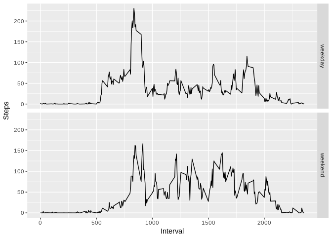

## Loading and preprocessing the data

```r
unzip("repdata%2Fdata%2Factivity.zip")
activity <-read.csv("activity.csv")
```

## What is mean total number of steps taken per day?

```r
dailysteps <- aggregate(activity$steps, by = list(activity$date), FUN = "sum")
hist(dailysteps$x, main="Steps taken each day", xlab="Number of steps")
```

<!-- -->

```r
meansteps <- mean(dailysteps$x, na.rm = TRUE)
mediansteps <- median(dailysteps$x, na.rm = TRUE)
```

Mean: 1.0766189\times 10^{4}  
Median: 10765

## What is the average daily activity pattern?


```r
stepspattern <- aggregate(activity$steps, by = list(activity$interval), FUN = "mean", na.rm = TRUE)
plot(stepspattern$x ~ stepspattern$Group.1, type = "l", main="Average steps taken in a given 5-minute time interval", xlab="Time Interval", ylab="Steps")
```

<!-- -->

```r
maxinterval <- stepspattern[stepspattern$x==max(stepspattern$x),1]
```
Highest interval: 835


## Imputing missing values


```r
numberNA <- sum(is.na(activity$steps))
```

There are 2304 rows that are missing step values. In order to account for these missing values, the data set will be amended by replacing the NA values by the average observed for that specific time interval (across all days).


```r
activity2 <- activity
for (i in 1:nrow(activity2)){
  if (is.na(activity2[i,"steps"])){
    activity2[i,"steps"] <- stepspattern[stepspattern$Group.1==activity2[i,"interval"],2]
  }
}
```


```r
dailysteps2 <- aggregate(activity2$steps, by = list(activity2$date), FUN = "sum")
hist(dailysteps2$x, main="Steps taken each day (Revised)", xlab="Number of steps")
```

<!-- -->

```r
meansteps2 <- mean(dailysteps2$x, na.rm = FALSE)
mediansteps2 <- median(dailysteps2$x, na.rm = FALSE)
```

Revised Mean: 1.0766189\times 10^{4}  
Revised Median: 1.0766189\times 10^{4}

As we can see, replacing the NA values by the average amount of steps for that time interval does not materially shift the mean or median of the total amount of steps per day. However, we can also note that NA values spanned entire days, meaning those days were ultimately filled with the average amount of steps per day. This results in a material increase in the 10k-15k bucket on the histogram (also note scale). All other buckets retained their original values and were not affected by the NA value replacement.

## Are there differences in activity patterns between weekdays and weekends?


```r
activity3 <- activity2
activity3[,4] <- as.factor(c("weekday","weekend"))
for (i in 1:nrow(activity3)){
  if (weekdays(as.Date(activity3[i,"date"])) %in% list("Saturday", "Sunday")){
    activity3[i,4] <- "weekend"
  } else { 
    activity3[i,4] <- "weekday"
  }
}
library(ggplot2)
dailysteps3 <- aggregate(activity3$steps, by = list(activity2$interval, activity3$V4), FUN = "mean")
ggplot(dailysteps3, aes(Group.1, x)) + geom_line() + facet_grid(Group.2 ~.) + labs(x="Interval", y="Steps")
```

<!-- -->
